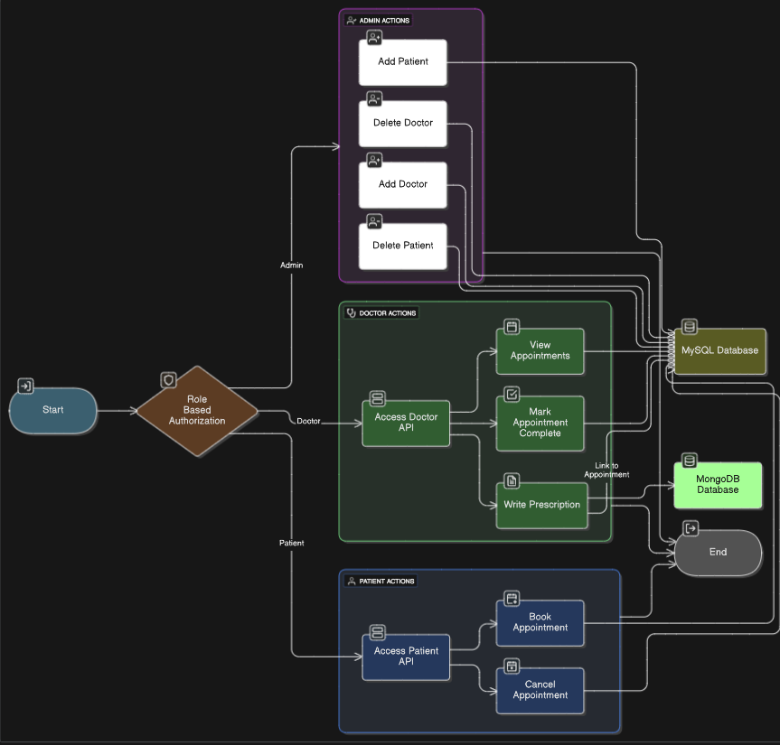
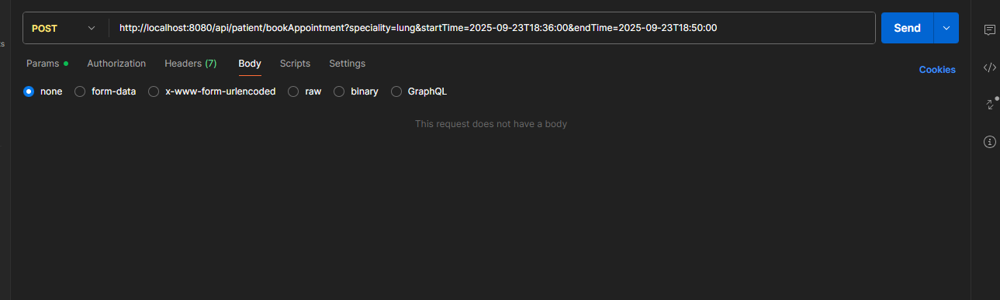
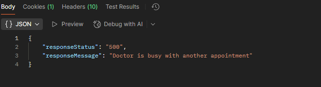
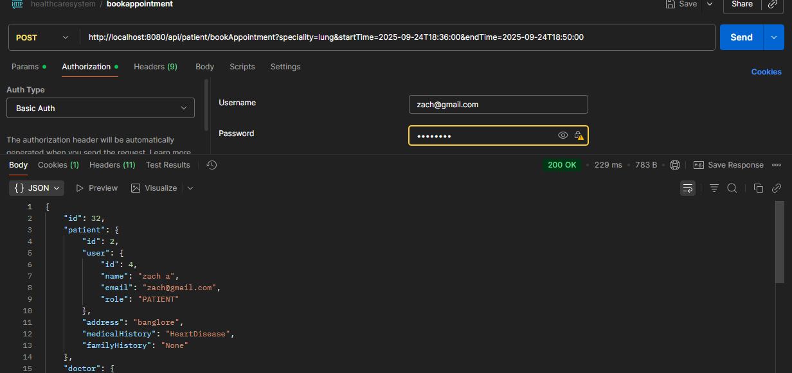
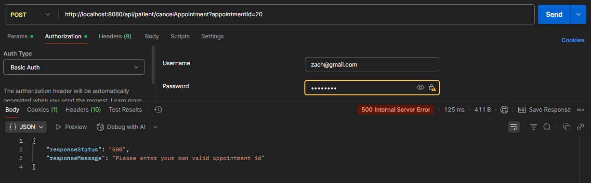
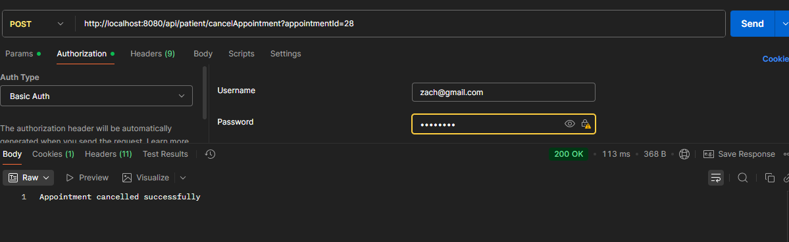
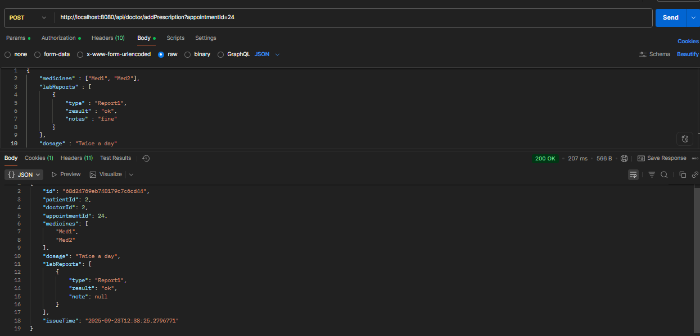
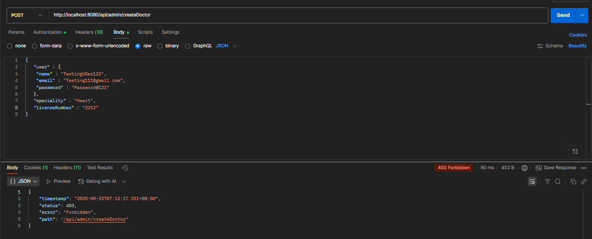
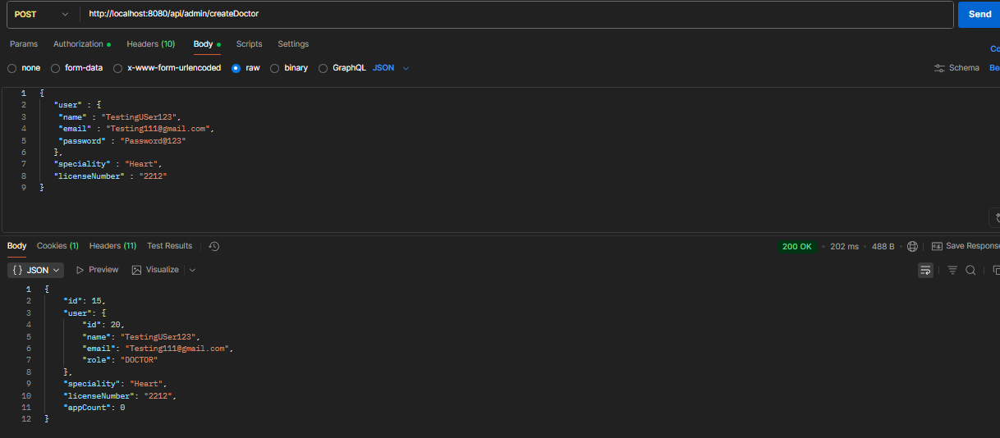

# Smart Health Care Appointment System
# Description
A smart health care appointment system that allows patients to book appointments with doctors and view their prescription history.
Admin can create, delete or update doctors and patients or view all patients and doctors. Patient or doctor can be created on its own or can be linked 
to an already existing user in database.
Doctors can view their appointments or specifically today's appointments and add prescription to the patient's appointments
or can mark appointments as completed.
Patients can book or cancel appointment to a doctor based on their speciality and appointment will be booked only if doctor is not busy with 
another appointment.
Patients can also view their prescription history which includes medication, dosage and labreports.
Users can update their personal details including name, address, medical history, family history for patient and
speciality and licenseNumber for doctor.

# Features
- User Authentication(spring security basic auth)
- Role Based Authorization(doctor can only access /api/doctor and patient can only access /api/patient)
- mysql database to store users and mongodb to store prescriptions
- Global Exception Handler
- Aspect Oriented Programming(AOP) for logging the booking of appointments and prescription updates.
- hibernate cache to store most frequently booked doctors.
- Custom password validator to validate password strength.
- Custom exceptions for handling different error scenarios.
- Validation for class fields.
- Pagination while displaying doctors and patients

# How to run the app
- Clone the repository
- Configure the databases in application.properties file
- Run command "mvn clean install" to build the app
- Run the app using command "mvn spring-boot:run" or the run button in your IDE.

# Flow diagram of the app

# Postman screenshots
# Booking appointment if doctor is busy

    
# Booking if doctor is available

# Cancelling someone else's appointment

# Cancelling own appointment

# Add prescription by doctor

# Only admin can create User

